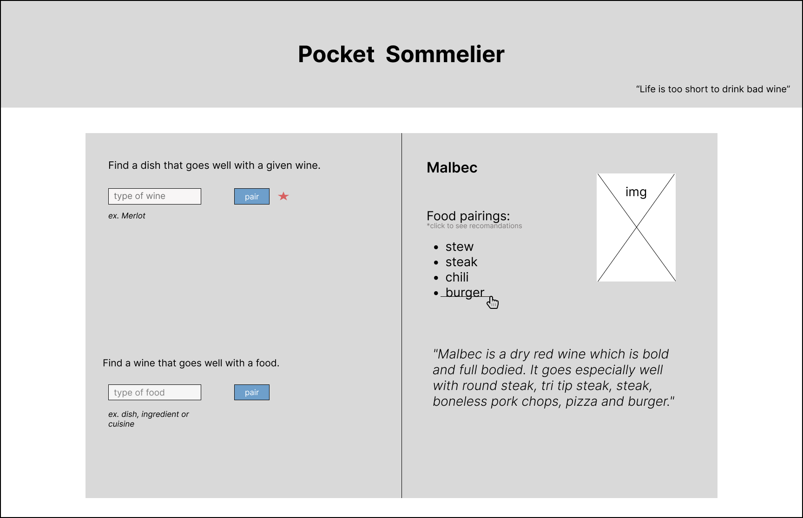
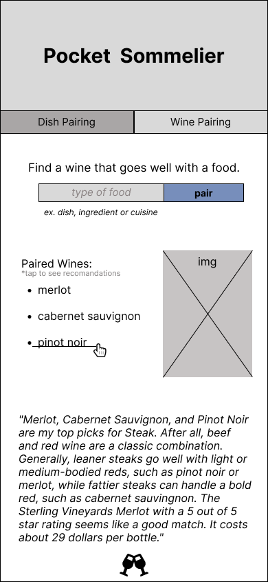

# Pocket Sommelier

##### Food and Wine Pairing Guide. 

This project will help you find a good food match for your wine or vice versa. The app presents you with two search options, one that will look for a food pairing for the specific wine, and other will look for a wine pairing for the choice of food. The search result will display on the page with the serving recommendations, wine descriptions and images. 

### Technologies Used

- HTML
- CSS
- Google Fonts
- JavaScript
- JQuery
- Figma
- GitHub
- Vercel
- Spoonacular API

### Wireframes

##### Desktop version

##### Mobile version

### Daily Plan

| Day | Goal |  |  |
|-----|-----|------|-----|
| 1 | Read API documentation | Render data to the screen | Commit to GitHub |
| 2 | Create HTML form |  Make AJAX requests  | Commit to GitHub |
| 3 | Add event listeners | Populate the DOM with API data | Commit to GitHub |
| 4 | Add CSS styiling | Create animation  | Commit to GitHub |
| 5 | Implement bonus features | Improve code quality | Commit to GitHub |

### Link to Project
[My Project Live Page](https://www.google.com)
